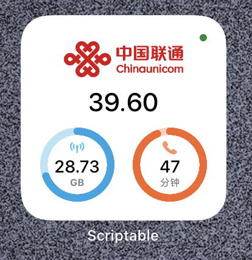
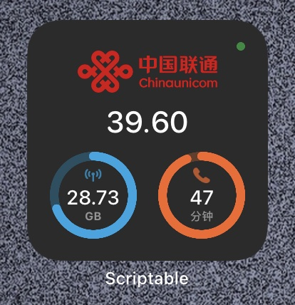
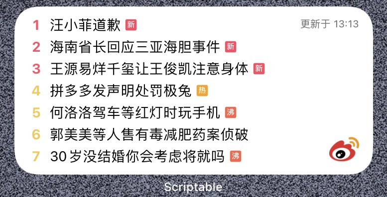
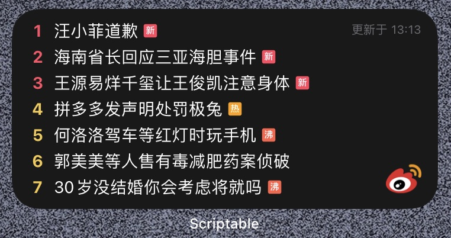

# Scriptable Scripts

Some scripts used in the iOS app [Scriptable](https://scriptable.app/). 

## Installer Shortcut

Quick install Scriptable script via the share menu, clipboard or scan QRCode.

Quick install the [Installer](#Installer) script.

[Link](https://www.icloud.com/shortcuts/5348320491144e2f8b594d4a934e678e)

## Installer

Quick install Scriptable script via the share menu.

Features:

1. When accessing the JS file online, it can be installed directly through the share menu.
2. Support to install JS files through URL Scheme. `scriptable:///run/installer?url=<encoded url>` or `https://open.scriptable.app/run/installer?url=<encoded url>`

[Source Code](https://raw.githubusercontent.com/Honye/scriptable-scripts/master/installer.js)

## 10010

- Show the balance, remaining flow, signin state, etc.
- Support dark mode
- Support update

|                       Light                       |                      Dark                       |
| :-----------------------------------------------: | :---------------------------------------------: |
|  |  |

[Source code](https://raw.githubusercontent.com/Honye/scriptable-scripts/master/10010/10010.js)

[Quick install](https://open.scriptable.app/run/installer?url=https%3A%2F%2Fraw.githubusercontent.com%2FHonye%2Fscriptable-scripts%2Fmaster%2F10010%2F10010.js) (must have [Installer](#Installer) installed)

## Douban

Daily movie

|                     Small                      |                     Medium                      |    Large    |
| :--------------------------------------------: | :---------------------------------------------: | :---------: |
|  |  | Not support |

[Source code](https://raw.githubusercontent.com/Honye/scriptable-scripts/master/douban/Douban.js)

[Quick install](https://open.scriptable.app/run/installer?url=https%3A%2F%2Fraw.githubusercontent.com%2FHonye%2Fscriptable-scripts%2Fmaster%2Fdouban%2FDouban.js) (must have [Installer](#Installer) installed)

## Weibo

Weibo hotsearch without ads

- Customizable appearance. Support `system`, `light` and `dark`
- Customizable using client. Suport [Weibo intl.](https://apps.apple.com/cn/app/weibo-intl/id1215210046?l=en) and [H5](https://m.weibo.cn/)

Fill your prefer `client`  and `theme` in the widget Parameter, separated by commas. Like `2,dark`

| Parameter | Description                   |
| --------- | ----------------------------- |
| client    | `1` (H5) or `2` (Weibo intl.) |
| theme     | `system`, `light` or `dark`   |

| Medium & Light                                     | Medium & Dark                                    |
| :------------------------------------------------- | ------------------------------------------------ |
|  |  |

[Source code](https://raw.githubusercontent.com/Honye/scriptable-scripts/master/weibo/Weibo.js)

[Quick install](https://open.scriptable.app/run/installer?url=https%3A%2F%2Fraw.githubusercontent.com%2FHonye%2Fscriptable-scripts%2Fmaster%2Fweibo%2FWeibo.js) (must have [Installer](#Installer) installed)

## GitHub Contributions

Fill your username and theme in the widget Parameter, separated by commas. 

- Theme support `system` (default), `light` and `dark`
- Tap the widget open the user GitHub page

| Small & Light                                                | Medium & Dark                                                |
| ------------------------------------------------------------ | ------------------------------------------------------------ |
|  |  |

[Source code](https://raw.githubusercontent.com/Honye/scriptable-scripts/master/dist/GitHub%20Contributions.js)

[Quick install](https://open.scriptable.app/run/Installer?url=https%3A%2F%2Fraw.githubusercontent.com%2FHonye%2Fscriptable-scripts%2Fmaster%2Fdist%2FGitHub%2520Contributions.js) (must have [Installer](#Installer) installed)
