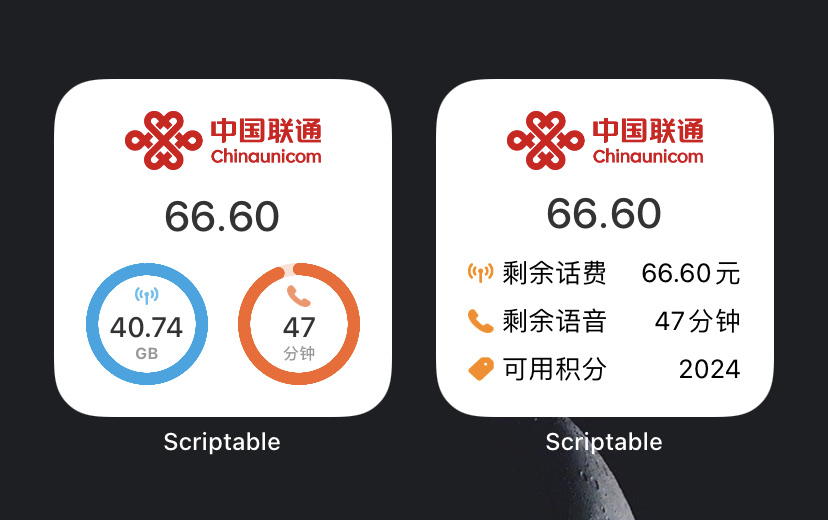

# Scriptable Scripts

Some scripts used in the iOS app [Scriptable](https://scriptable.app/). 

## Installer Shortcut

Quick install Scriptable script via the share menu, clipboard or scan QRCode.

Quick install the [Installer](#Installer) script.

[Link](https://www.icloud.com/shortcuts/5348320491144e2f8b594d4a934e678e)

## Installer

Quick install Scriptable script via the share menu.

Features:

1. When accessing the JS file online, it can be installed directly through the share menu.
2. Support to install JS files through URL Scheme. `scriptable:///run/installer?url=<encoded url>` or `https://open.scriptable.app/run/installer?url=<encoded url>`

[Source Code](https://raw.githubusercontent.com/Honye/scriptable-scripts/master/installer.js)

## 10010

Show the balance, remaining flow, etc.

[Source code](https://raw.githubusercontent.com/Honye/scriptable-scripts/master/10010/10010.js)

[Quick install](https://open.scriptable.app/run/installer?url=https%3A%2F%2Fraw.githubusercontent.com%2FHonye%2Fscriptable-scripts%2Fmaster%2F10010%2F10010.js) (must have [Installer](#Installer) installed)