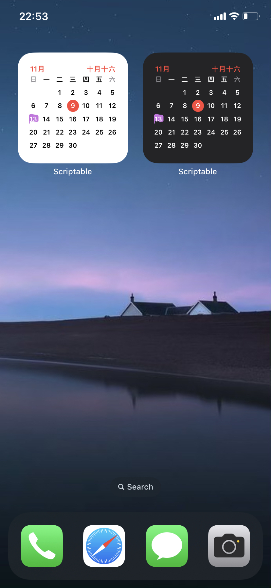

# Scriptable Scripts

中文｜[English](./README.en.md)

[iOS Scriptable](https://scriptable.app/) | [TestFlight](https://testflight.apple.com/join/uN1vTqxk) | [macOS Scriptable](https://scriptable.app/mac-beta/)

- Scriptable 脚本打包器，多合一方便分享传播
- 常用组件化和 API
- 几个自己在用的脚本

统一说明：

本仓库组件配置项多个参数统一使用 `,` 分隔填入 Parameter 输入框

## 安装器（快捷指令版本）

通过扫 JS 文件链接二维码、剪贴板的文件链接或链接分享菜单快速安装脚本

也可快速安装 [Scriptable 安装器](#Installer)

[点击安装](https://www.icloud.com/shortcuts/768a7435136749959554568ca7b498bd)

## Installer

通过文件链接分享菜单快速安装脚本

功能：

1. 在线访问 JS 文件时，可通过分享菜单快速安装该 JS 文件
2. 通过 URL Scheme 可实现脚本分享并快速安装。`scriptable:///run/Installer?url=<encoded url>` 或 `https://open.scriptable.app/run/Installer?url=<encoded url>`
3. PC 开发时支持通过局域网同步脚本

[源码](https://raw.githubusercontent.com/Honye/scriptable-scripts/master/dist/Installer.js)

## CoinGecko 加密货币实时价

[JSBox 版本](https://github.com/wuzeyou/PriceWidgets)

| 配置项目 | 说明 |
| ------ | ---- |
| symbol | [CoinGecko](https://www.coingecko.com/) 货币符号，如：`BTC` |

| 预览 |
| ---- |
|  |

[源码](https://raw.githubusercontent.com/Honye/scriptable-scripts/master/dist/CoinGecko.js)

[快速安装](https://open.scriptable.app/run/Installer?url=https%3A%2F%2Fraw.githubusercontent.com%2FHonye%2Fscriptable-scripts%2Fmaster%2Fdist%2FCoinGecko.js) (需先安装 [Installer](#Installer))

## Calendar

- 中国农历日期显示
- 指定日历显示。可作为打卡日历

| 配置项      | 说明                   |
| -------------- | ----------------------------- |
| 日历标题 | 系统日历标题 |
| symbol         | 符号作为事件日期的背景 |
| theme          | `light`, `dark` |

| 预览 |
| ---------- |
|  |

[源码](https://raw.githubusercontent.com/Honye/scriptable-scripts/master/dist/Calendar.js)

[快速安装](https://open.scriptable.app/run/Installer?url=https%3A%2F%2Fraw.githubusercontent.com%2FHonye%2Fscriptable-scripts%2Fmaster%2Fdist%2FCalendar.js) (需先安装 [Installer](#Installer))

## 10010

中国联通信息展示

- 展示话费余额、流量套餐余额、语音套餐余额和签到状态
- 支持暗黑模式
- 可检测并更新脚本

|                       Light                       |                      Dark                       |
| :-----------------------------------------------: | :---------------------------------------------: |
|  |  |

[源码](https://raw.githubusercontent.com/Honye/scriptable-scripts/master/dist/10010.js)

[快速安装](https://open.scriptable.app/run/Installer?url=https%3A%2F%2Fraw.githubusercontent.com%2FHonye%2Fscriptable-scripts%2Fmaster%2Fdist%2F10010.js) (需先安装 [Installer](#Installer))

## Douban

豆瓣每日电影卡片

|                     Small                      |                     Medium                      |    Large    |
| :--------------------------------------------: | :---------------------------------------------: | :---------: |
|  |  | Not support |

[源码](https://raw.githubusercontent.com/Honye/scriptable-scripts/master/dist/Douban.js)

[快速安装](https://open.scriptable.app/run/Installer?url=https%3A%2F%2Fraw.githubusercontent.com%2FHonye%2Fscriptable-scripts%2Fmaster%2Fdist%2FDouban.js) (需先安装 [Installer](#Installer))

## Weibo

微博热搜，无广告。点击单元项进入微博并搜索，点击 Logo 进入热搜列表

- 可自定义样式。支持 `system`（默认）, `light` 和 `dark`
- 可自定义使用什么客户端查看详情. 支持 [微博国际版](https://apps.apple.com/cn/app/weibo-intl/id1215210046?l=en) 和 [网页应用](https://m.weibo.cn/)
- 支持缓存。当请求失败（网络异常）时显示上次成功请求的结果

将配置填写在组件的 Parameter 输入框，不同配置间使用 `,` 分隔。例如 `2,dark`

| 配置项 | 说明                                                        |
| ------ | ----------------------------------------------------------- |
| client | 使用什么客户端查看详情，`1`（网页应用）or `2`（微博国际版） |
| theme  | 自定义样式，`system`, `light` 或 `dark`                     |

| Medium & Light | Medium & Dark | UI |
| :------------ | :----------- | :--- |
|  |  |  |

[源码](https://raw.githubusercontent.com/Honye/scriptable-scripts/master/dist/Weibo.js)

[快速安装](https://open.scriptable.app/run/Installer?url=https%3A%2F%2Fraw.githubusercontent.com%2FHonye%2Fscriptable-scripts%2Fmaster%2Fdist%2FWeibo.js)（需先安装 [Installer](#Installer)）

## GitHub Contributions

- 支持暗黑模式
- 点击组件打开用户 GitHub 主页

| 配置项   | 说明                                               |
| -------- | -------------------------------------------------- |
| username | GitHub 用户名，默认是作者本人                      |
| theme    | 样式，可选`system`、`light`、`dark`。默认 `system` |

| Small & Light                                                | Medium & Dark                                                |
| ------------------------------------------------------------ | ------------------------------------------------------------ |
|  |  |

[源码](https://raw.githubusercontent.com/Honye/scriptable-scripts/master/dist/GitHub%20Contributions.js)

[快速安装](https://open.scriptable.app/run/Installer?url=https%3A%2F%2Fraw.githubusercontent.com%2FHonye%2Fscriptable-scripts%2Fmaster%2Fdist%2FGitHub%2520Contributions.js) （需先安装 [Installer](#Installer)）

## Photos

随机展示照片

- 支持中英文
- 支持多相册多组件不同展示

| 配置项 | 说明         |
| ------ | ------------ |
| album  | 创建的相册名 |

| Albums (In APP)                                              | Photos (In APP)                                              | Widget                                                       |
| ------------------------------------------------------------ | ------------------------------------------------------------ | ------------------------------------------------------------ |
|  |  |  |

[源码](https://raw.githubusercontent.com/Honye/scriptable-scripts/master/dist/Photos.js)

[快速安装](https://open.scriptable.app/run/Installer?url=https%3A%2F%2Fraw.githubusercontent.com%2FHonye%2Fscriptable-scripts%2Fmaster%2Fdist%2FPhotos.js)（需先安装 [Installer](#Installer)）

## 掘金

### 参数

| 配置项 | 说明        |
| ------ | ----------- |
| cateID | 文章分类 ID |

#### cateID

| 属性值    | 说明     |
| --------- | -------- |
| `be`      | 后端     |
| `fe`      | 前端     |
| `android` | Android  |
| `ios`     | iOS      |
| `ai`      | 人工智能 |
| `tools`   | 开发工具 |
| `coding`  | 代码人生 |
| `reading` | 阅读     |

| Light Mode                                                   | Dark Mode                                                    |
| ------------------------------------------------------------ | ------------------------------------------------------------ |
|  |  |

[源码](https://raw.githubusercontent.com/Honye/scriptable-scripts/master/dist/Juejin.js)

[快速安装](https://open.scriptable.app/run/Installer?url=https%3A%2F%2Fraw.githubusercontent.com%2FHonye%2Fscriptable-scripts%2Fmaster%2Fdist%2FJuejin.js)（需先安装 [Installer](#Installer)）
